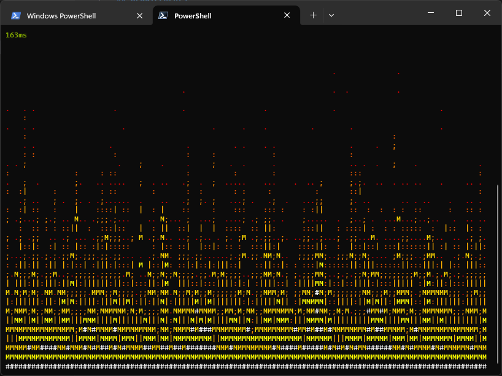

# PowerShell Fireplace

A port of [`ksh-fire`](https://github.com/wallyhall/ksh-fire) for PowerShell.

## Requirements

Tested on PowerShell 7.  YMMV beyond that!

## Screenshots

## Runtime arguments

You can optionally supply a single argument of an integer betewen 1 and 7 inclusive to adjust how "hot" the fire is.
